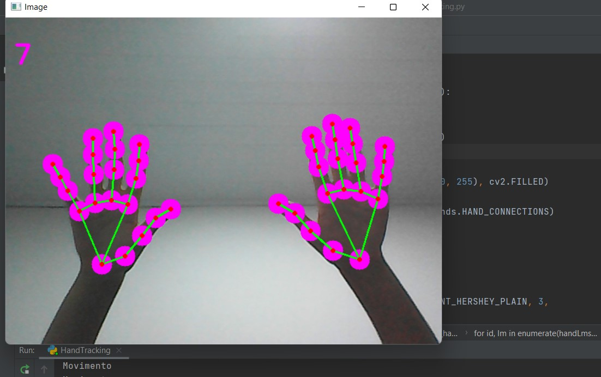

<h1>Detector de mãos com Python + OpenCV</h1>

Este é um código base para estudo introdutório em Visão Computacional, o detector de mãos pode ser usado em diversas situações e projetos, logo sinta-se a vontade para utilizá-lo em sistemas avulsos.
	

Foram utilizadas duas famosas bibliotecas no ramo de VC:<b> OpenCV e MediaPipe</b>
	
* <b>OpenCV</b> é uma biblioteca direcionada a visão computacional. Com a ajuda do OpenCV, podemos construir um grande número de sistemas que funcionam melhor em tempo real. É usado principalmente para processamento de imagens e videos.

Mais informações sobre o OpenCV podem ser adquiridas aqui (https://opencv.org/)

* 
<b>Mediapipe</b> é uma estrutura usada principalmente para criar dados de áudio, vídeo ou qualquer série de tempo. Com a ajuda da estrutura MediaPipe, podemos construir pipelines impressionantes para diferentes funções de processamento de mídia.

<b><h3>Você pode acessar o código pelo link: https://url.gratis/0JmsQf</h3></b>

<b><h2>Fotos do projeto:</h2></b>

