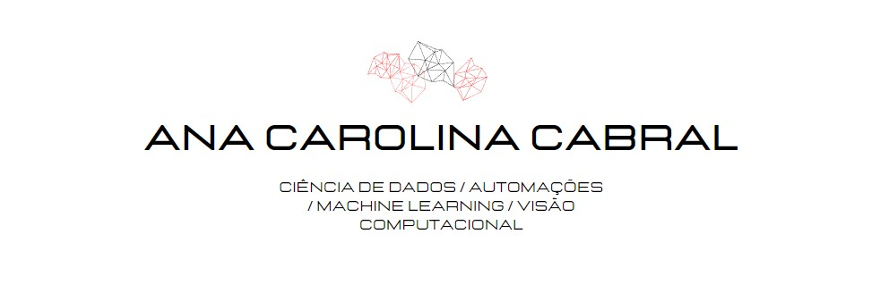

  

Aqui você pode encontrar meus projetos de Ciência de dados, Machine Learning, Automações com Arduino e Visão Computacional. Linguagens utilizadas: Python, C++, JavaScript, PHP e Golang. 

<b><h1>Projetos</h1></b>

<b><h2>Ciência de dados</h2></b>

**Banco e Finanças**

* **Avaliação de Risco de Crédito:** https://bityli.com/akTFv0

**Indústria Aeroespacial**

* **The evolution of the space sector since 1957:** https://bityli.com/3JThmT

<b><h2>Machine Learning</h2></b>

* **Sistema de Recomendação de Filmes:**

<b><h2>Visão Computacional</h2></b>

* **Detector de mãos com Python + OpenCV:** https://url.gratis/F46nMV

